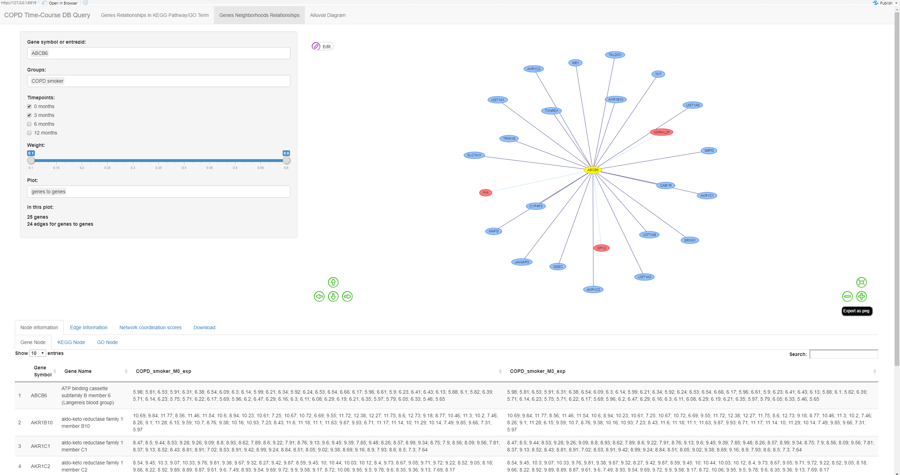

# Shiny app

## Description

This is a shiny app to explore and study the dynamic correlation network of time-course gene expression data of small airway cells in COPD patients. Studies include gene neighborhoods, co-expression modules, and intra-pathway correlations, among others.

We have used GEO data ([GSE108134](https://pmlegacy.ncbi.nlm.nih.gov/geo/query/acc.cgi?acc=GSE108134)). This dataset includes three groups (COPD smoker, smoker and non-smoker) and four time-points (0 months, 3 months, 6 months, and 12 months).

In order to find out the gene-gene correlations, we used the [WGCNA package](https://horvath.genetics.ucla.edu/html/CoexpressionNetwork/Rpackages/WGCNA/)
for each time-point and each group. For pathway information, we used `clusterProfiler::download_KEGG()` to download human KEGG pathways and the `biomaRt` package to convert gene IDs. For Gene Ontology (GO), we used the `GO.db` and `org.Hs.eg.db` packages for GO terms.

After collecting all gene-gene correlation scores, KEGG pathways, and GO terms, we imported all data into the Neo4j graph database, and built the shiny app to perform the different analyses and visualizations.

The app consists of four tabs: `Gene Relationships in KEGG Pathway/GO Term`, `Genes Neighborhoods Relationships` and `Alluvial Diagram`.

## Run this shiny app

**Step1:**   

Before you run this shiny app, you need to start the [neo4j database (version = 3.5.23)](https://neo4j.com/download-center/#community). Then, you need to download our database [here](http://www.moralab.science/downloads/database/neo4j-copd20201115.tar.gz) and copy it in the ... folder.  

**Step2**

Go to R and [install required R packages](install_package.R).

**Step3**  
```
library(RNeo4j)
#Option a) using your local neo4j, change the username and password:
#graph = startGraph("http://localhost:7474/db/data/", username="neo4j", password="password")

#Option b) using our public neo4j:
graph = startGraph("http://www.moralab.science:3838/db/data/", username="neo4j", password="xiaowei")

#run shiny
library(shiny)
runGitHub("mora-lab/TC-DATABASE_shiny")
```

## Tutorial

## 1. Gene Relationships in KEGG Pathway/GO Term
This tab is for query genes relationship in each time and groups under KEGG pathway or/and GO term.

### 1.1 KEGG ID or KEGG pathway
You can input one or more KEGG ID or KEGG pathway to query. It means the genes are belong to KEGG pathway your query, and show that genes relationship.
if you didn't input KEGG ID or KEGG pathway, the result will not show you any about KEGG information or relationship.

### 1.2 GO ID or GO Term
You also can input one or more GO Term. It means the genes are belong to GO term your query, and show that genes relationship.
It is the same of KEGG option, the result will not show you any about GO information or relationship.

**Notes**   
You can input GO Term and KEGG pathway at the same time.


### 1.3 Groups
**You must choose at least one group for query.**  
We set this option has three groups: `COPD smoker`, `smoker` and `nonsmoker`.
You can chose one or more groups to get whether those genes have relationship under groups your query.

### 1.4 Timeponts
Here has 4 timepoints, when you chose those timepoints, it means you want to query those gene relationship at that timepoint(**NOT ONLY THAT TIMEPOINTS**).

### 1.5 Weight
This option will be show if you chose the timepoints.  
This weight is for WGCNA weight threshold, it has two option: the min weight and the max weight.

### 1.6 Plot
This option is ask you which type relationship you want plot in this network plot.
It has three option: `genes to genes`, `genes to KEGG`, `genes to GO`.
Only you chose KEGG pathway or GO, it will show you the `genes to KEGG` or `genes to GO` relationship.


### 1.7 Node information, Edge information, Network coordination scores and Download
That show you those nodes and edge information in the network plot. It also make some button for download those information.


## 2. Genes Neighborhoods Relationships
This tab is for query special genes relationship in each time and groups.

### 2.1 Gene symbol or entrezid
**You must choose at least one gene for query.** you can input gene symbol name or ENtrezid.  

### 2.2 Groups
**You must choose at least one group for query.**  
We set this option has three groups: `COPD smoker`, `smoker` and `nonsmoker`.
You can chose one or more groups to get whether those genes have relationship under groups your query.

### 2.3 Timeponts
Here has 4 timepoints, when you chose those timepoints, it means you want to query those gene relationship at that timepoint(**NOT ONLY THAT TIMEPOINTS**).

### 2.4 Weight
This option will be show if you chose the timepoints.  
This weight is for WGCNA weight threshold, it has two option: the min weight and the max weight.

### 2.5 Plot
This option is ask you which type relationship you want plot in this network plot.
It has three option: `genes to genes`, `genes to KEGG`, `genes to GO`.
**If you didn't chose `genes to genes`, it means you only want to plot relationship between KEGG/GO and genes your input.**

### Node information, Edge information, Network coordination scores and Download
That show you those nodes and edge information in the network plot. It also make some button for download those information.




## 3. Alluvial Diagram

### 3.1 Groups
We set this option has three groups: `COPD smoker`, `smoker` and `nonsmoker`.
You only chose one group to plot. This Alluvial plot will show you genes changing in WGNCA module in each timepoints in special group. 

### 3.2 Alluvial data and download
Here show you the alluvial plot data and download option.


